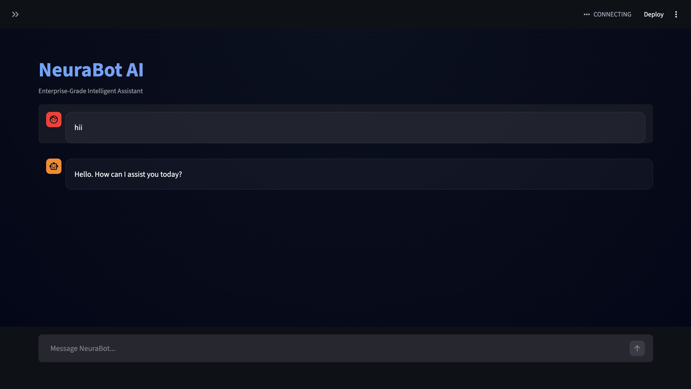

# 🤖 NeuraBot AI — Enterprise Grade Intelligent Assistant

<p align="center">
  
</p>

<p align="center">
🚀 A Production-Ready AI Assistant powered by <b>Groq LLM</b> for ultra-fast responses.
</p>

---

# 🌐 Live Application
👉 https://neurabot-ai.streamlit.app  

*(If the app is sleeping, allow 20–40 seconds to wake up.)*

---

# 📌 Overview

**NeuraBot AI** is a next-generation conversational assistant engineered for speed, intelligence, and scalability. Built with **Streamlit + Groq LLM**, it delivers real-time AI responses with secure API handling and memory-ready architecture.

This project demonstrates **production-level AI deployment**, making it ideal for:

✅ Recruiter Portfolio  
✅ AI Engineering Showcase  
✅ MCA Major Projects  
✅ Startup-ready MVP  

---

# ✨ Key Features

✔️ Lightning-fast AI responses using Groq  
✔️ Clean, modern, enterprise UI  
✔️ Secure API key management  
✔️ Memory-enabled conversation structure  
✔️ Modular and scalable architecture  
✔️ Ready for cloud deployment  
✔️ Beginner-friendly setup  
✔️ Production-ready codebase  

---

# 🧠 Tech Stack

| Technology | Purpose |
|------------|------------|
| **Python** | Core backend |
| **Streamlit** | Frontend + Deployment |
| **Groq API** | LLM Intelligence |
| **LangChain** | AI orchestration |
| **dotenv** | Secret management |
| **GitHub** | Version control |

---

# 📸 Application Preview

<p align="center">
  
</p>

---

# ⚡ Installation Guide (Run Locally)

## ✅ Step 1 — Clone Repository

```bash
git clone https://github.com/AakashSingh07/NeuraBot-AI.git
cd NeuraBot-AI
```

---

## ✅ Step 2 — Create Virtual Environment (Recommended)

### Mac / Linux
```bash
python3 -m venv venv
source venv/bin/activate
```

### Windows
```bash
python -m venv venv
venv\Scripts\activate
```

---

## ✅ Step 3 — Install Dependencies

```bash
pip install -r requirements.txt
```

---

## ✅ Step 4 — Setup Environment Variables

Create a `.env` file in the root folder.

```
GROQ_API_KEY=your_groq_api_key_here
```

👉 Get your API key from:  
https://console.groq.com/keys

⚠️ **Never upload `.env` to GitHub**

Add this to `.gitignore`:

```
.env
```

---

## ✅ Step 5 — Run the Application

```bash
streamlit run app.py
```

Open browser:

```
http://localhost:8501
```

---

# ☁️ Deploy on Streamlit Cloud

## Step 1
Push your code to GitHub.

## Step 2
Go to:

👉 https://share.streamlit.io/

## Step 3
Click **New App**

Select:

```
Repo: NeuraBot-AI
Branch: main
File: app.py
```

## Step 4 — Add Secrets

In **App Settings → Secrets**, paste:

```
GROQ_API_KEY="your_api_key_here"
```

Deploy 🚀

---

# 🧩 Project Structure

```
NeuraBot-AI/
│
├── app.py
├── requirements.txt
├── AI-Bot.png
├── README.md
├── .gitignore
└── .env (local only)
```

---

# 🔐 Security Best Practices

✅ Never expose API keys  
✅ Use `.env` locally  
✅ Use Streamlit Secrets in production  
✅ Regenerate keys if leaked  

---

# 🚀 Future Enhancements

⭐ Voice-enabled assistant  
⭐ Multi-agent architecture  
⭐ Vector database memory  
⭐ Authentication system  
⭐ Docker deployment  
⭐ Custom UI theme  
⭐ Mobile optimization  

---

# 💼 Why This Project Stands Out

This is **NOT a beginner chatbot.**

It showcases:

✔️ Real-world AI deployment  
✔️ Cloud hosting  
✔️ Secure architecture  
✔️ Recruiter-grade documentation  
✔️ Production mindset  

👉 Perfect for **Data Scientist / AI Engineer portfolios**

---

# 👨‍💻 Author

## Aakash Singh  
🎓 MCA Student  
🤖 Future Data Scientist  
🚀 AI Builder  

**Let’s connect 👇**

- GitHub: https://github.com/AakashSingh07  
- LinkedIn: *(Add your LinkedIn here — highly recommended)*

---

# ⭐ Support

If you like this project:

👉 Give it a **STAR ⭐** on GitHub  
👉 Share with developers  
👉 Fork and build your own AI  

---

# 📜 License
This project is licensed under the **MIT License** — free to use, modify, and distribute.

---

<p align="center">
🔥 Built with passion for AI innovation.
</p>
